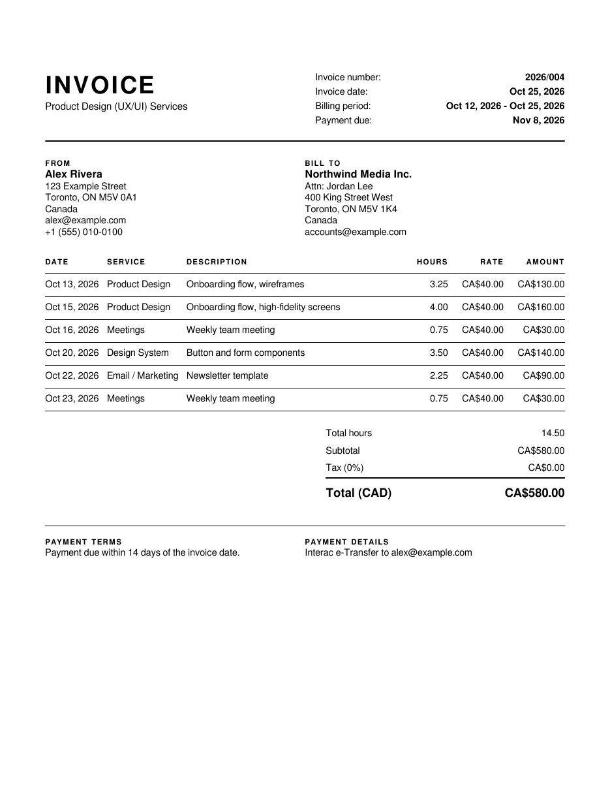

# Freelancer & Contractor Invoice

A clean, single-page invoice template for [Kimai](https://www.kimai.org), built for freelancers and contractors who bill by the hour. 

It's black-and-white, prints cleanly to PDF, and lets Kimai handle all calculations (hours, rates, line totals, and subtotals). Empty sections (like tax or payment details) hide automatically so there are no awkward blank gaps.

## Features

- **Single page**: Compact layout designed to fit on one page (Letter or A4).
- **Clean header**: Invoice number, issue date, billing period, and due date in one unified block.
- **Side-by-side parties**: Contractor ("From") and Client ("Bill to") side-by-side with an optional "Attn:" line.
- **One row per task**: Itemizes date, service/activity, description, hours, rate, and line total.
- **Payment block**: Dedicated sections for payment terms and payment details (e-Transfer, bank wire, PayPal, etc.).
- **Customizable**: Quick switches at the top of the template file let you toggle columns (rates, tax, billing period) and switch between Letter and A4 paper.
- **Twig sandbox compliant**: Works out of the box with Kimai's default security rules.

## Recommended Kimai settings

- **Calculator**: In your template settings (**Invoices > Templates**), keep the calculator set to **One row per entry** (default) so each timesheet entry is itemized on its own line with its date, activity, and task description.
- **Rounding mode**: Under **System > Settings > Invoices**, setting rounding mode to `decimal` ensures `hours × rate` matches the line total to the exact cent without rounding discrepancies from raw seconds.

## License

Shared with the Kimai community under the [MIT License](https://opensource.org/licenses/MIT).
